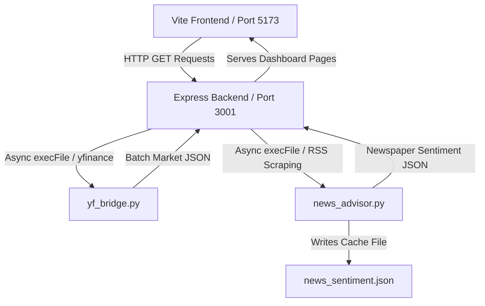

# 📊 StockPulse AI — Geopolitical Sentiment & Technical Dashboard (NSE Focus)

StockPulse AI is a premium, real-time portfolio management and newspaper-based sentiment predictor dashboard optimized for Indian stocks (NSE). 

Operating entirely locally with zero paid API dependencies, it combines standard financial technical indicators with an offline newspaper scraper to run advanced Natural Language Processing (NLP) sentiment modeling on both global macroeconomics and local developments.

---

## 🎨 Architecture & Tech Stack



- **Frontend:** HTML5, Modern Vanilla CSS3 (Glassmorphism design language, customized typography, neon glow states), client-side Javascript.
- **Backend Proxy:** Node.js, Express, CORS, child process execution.
- **Data Engine:** Python 3, `yfinance` library, dictionary-based sentiment scoring, Google News RSS XML parser.

---

## 💡 Key Features

### 1. Global Geopolitical Sentiment & Indian Markets Predictor
A glassmorphic advisory control center featuring:
- **Glowing Sentiment Index Circle:** Dynamic radial gauge showing Nifty direction (`BULLISH` in emerald, `BEARISH` in pink, `NEUTRAL` in cyan) with localized commentary on US Federal updates, global tensions, budgets, and corporate earnings.
- **Sectoral Sentiment Breakdown (7 Key Meters):**
  1. *Global Impact on NSE* (Fed rates, inflation, wars)
  2. *Politics & Reforms* (Union Budget, GDP reforms, cabinet decisions)
  3. *Industrial & Economy* (RBI repo rates, capital metrics)
  4. *AI & Technology* (IT export shifts, software majors' margins)
  5. *Pharma Sector* (Generic drug exports, defensive healthcare indexes)
  6. *Growth Startups* (Unicorn funding, SME IPO listings, Quick-Commerce/Fintech trends)
  7. *Short-Term Momentum* (Breakout swing plays, technical buy targets)
- **Daily Actionable Trades (NSE):** Scans newspapers to issue precise `BUY`, `HOLD`, or `SELL` guidelines for owned assets (`PHARMABEES.NS`, `NEXT50IETF.NS`) and growth/momentum selections (`ZOMATO.NS`, `JIOFIN.NS`, `IREDA.NS`, `HAL.NS`).
- **Compact Live Newspaper Feed:** Renders 21 parsed headlines categorized with glowing tag tags.

### 2. Technical Indicators Crossover Engine (`yf_bridge.py`)
Computes indicators locally on 3 months of daily historical data:
- **RSI (14):** Detects overbought ($>65$) or oversold ($<35$) reversals.
- **EMA Crossovers:** Analyzes Short-term (9-period) vs Mid-term (21-period) trends.
- **MACD (12, 26, 9):** Flags MACD vs Signal line crossovers.

### 3. Background Cron Agent Scheduler
Ensures newspaper updates are processed twice daily:
- **IST Market Open (9:00 AM):** Evaluates pre-market newspapers and overnight global indexes.
- **IST Pre-Close (3:00 PM):** Highlights intraday news spikes and closing strategies.

---

## 🚀 Dev Setup & Local Deployment

### 📋 Prerequisites
- **Node.js** (v16+)
- **Python 3**
- **pip libraries**: `yfinance`

```bash
# Install Python prerequisites
pip3 install yfinance
```

### 🛠️ Installation
1. Clone the repository:
   ```bash
   git clone https://github.com/Manojponugoti64/stockpulse-ai-dashboard.git
   cd stockpulse-ai-dashboard
   ```
2. Install Node dependencies:
   ```bash
   npm install
   ```

### ⚡ Running the Dashboard
Run the servers concurrently in development mode:
```bash
npm run dev
```

- **Frontend Interface:** `http://localhost:5173`
- **Proxy Server API:** `http://localhost:3001`

---

## 📈 Future Developments
- Real-time Kite Connect/Groww portfolio sync integration.
- Custom machine learning sentiment weights based on sector-specific historical correlations.
- Support for options chain open interest (OI) crossover scans.

---
*Created and maintained by [Manojponugoti64](https://github.com/Manojponugoti64).*
